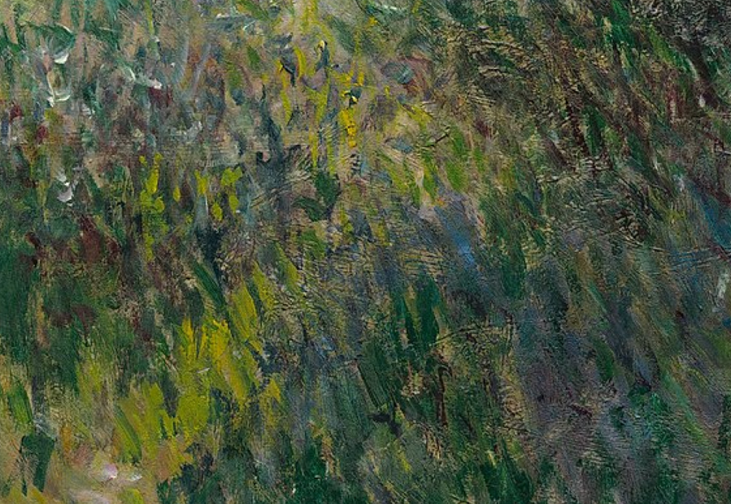
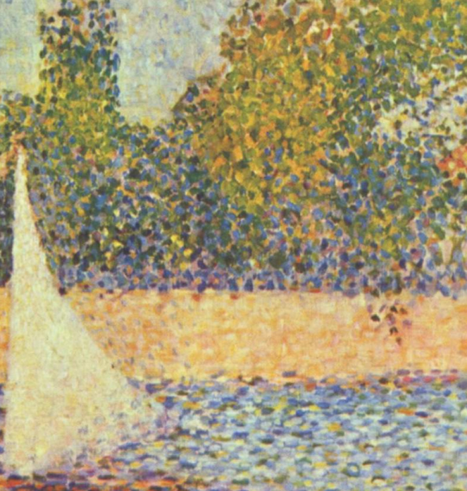
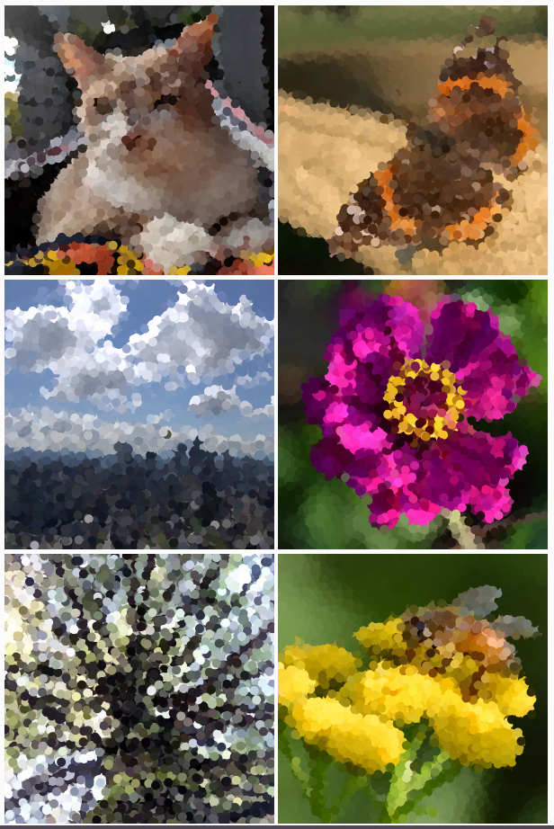

# Quiz8
Ziqian Chen zche0245_9103_Quiz8
### Part 1
The imaging techniques are inspired by Impressionism and Neo-Impressionism. They present real-life scenes in the form of blended patches of colour on the artwork. It's a very creative way of processing images. Pointillism, where the painting is composed of patches or blocks of similar colours, was a common technique they used.
This imaging technique can be applied to our Major projects to reconstruct existing artwork and create something more by changing the parameters.

***Woman with a Parasol*** painted by ***Claude Monet***



***The Seine and la Grande Jatte-Springtime*** painted by ***George Seurat***



### Part 2
I have discovered a technique called Pixel painter in the happycoding.io website. It creates spots by randomly selecting pixel points from the original image and repeating them to create a pointillism-like artwork.
```
let img;

function preload() {
  img = loadImage('images/bee.jpg');
}
function setup() {
  createCanvas(600, 600);

  // Resize the image so it fits on the screen
  img.resize(width, height);

  noStroke();
}

function draw() {

  // Get the color of a random pixel.
  img.loadPixels();
  const pixelX = random(width);
  const pixelY = random(height);
  const pixelColor = img.get(pixelX, pixelY);

  // Paint that pixel with a circle.
  fill(pixelColor);
  ellipse(pixelX, pixelY, 20, 20);
}
```


Based on this technique, we can modify the style and conditions of the generated patterns. This makes the texture of the artwork more complex and interesting.

Other examples from ***happycoding.io***

Post link: https://happycoding.io/tutorials/p5js/images/pixel-painter
